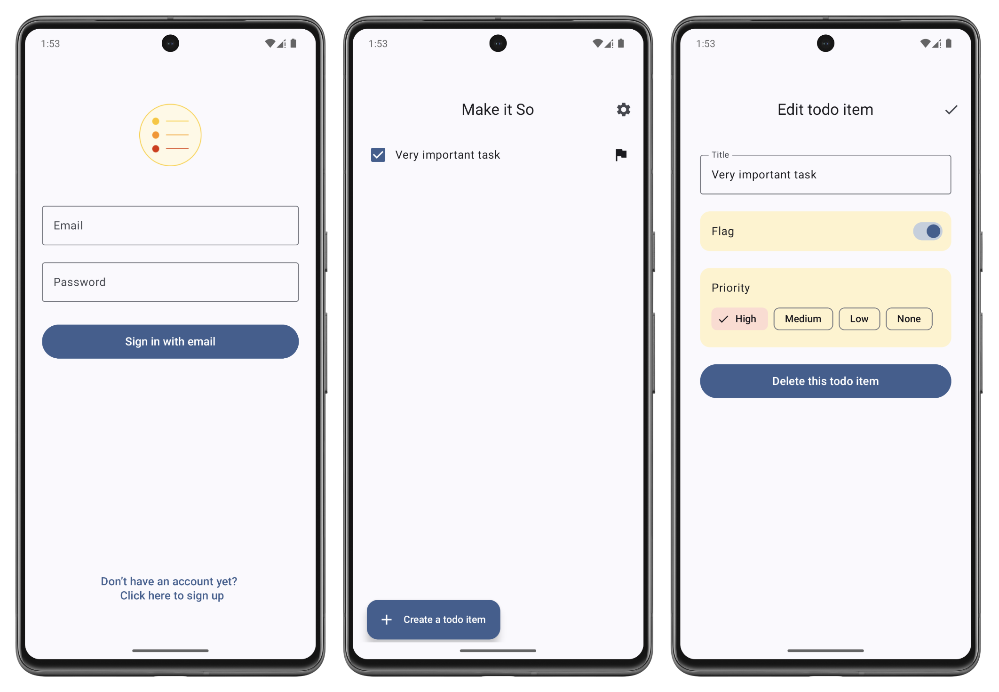

# mobileApp

## 김태원의 **모바일 앱** 수업

### 모바일앱 수업을 하나의 게임이라고 생각하기
- 인생도 어차피 게임이다.
- 안드로이드 studio 왼쪽 editor 창에서 타이핑하면, 오른쪽 뷰에서 원하는 게 보인다.
- 내 local PC에서 작업하고 pithub으로 push(게시)하면, 마치 내 유튜브 채널에 동영상 올린 거다.
- 먼저 내 github 채널을 다른 학생들에게 공유하면 가점 부여 가능

---
9/10일 코틀린을 배워보자!
-----
```kotlin
fun main() {
  println("Hello Compose!")
}
```

---
### README 안에 이미지가 보이도록 하려면?

GitHub의 `README.md` 파일에 이미지를 표시하려면, 기본적으로 Markdown 문법을 사용합니다. 하지만 올바르게 표시되려면 **이미지 경로**와 **저장 위치**가 맞아야 해요. 아래에 단계별로 정리해드릴게요.

---

## 1단계: 이미지 준비

* 사용하려는 이미지를 프로젝트 root 내  폴더에 넣습니다.
  * 예: `public/images/ui_screen_todo_app.png`

---

## 2단계: 이미지 파일 GitHub에 업로드

1. 로컬 저장소에 이미지가 없다면 추가하고,
2. `git add`, `git commit`, `git push`를 통해 GitHub 원격 저장소로 업로드합니다.

```bash
git add images/myimage.png
git commit -m "Add image for README"
git push
```

---

## 3단계: Markdown 문법으로 이미지 추가

README.md에서 아래 형식을 사용합니다:

```markdown

```

* 예시:

```markdown

```

---
